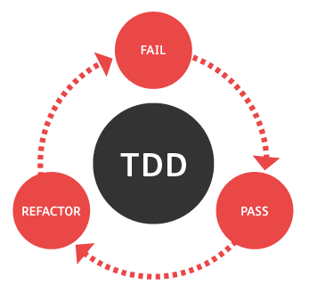

Cultivating the right problem solving skills
=============================

---


<ul style="list-style: none;">
	<li><i class="fa fa-github" aria-hidden="true"></i>&nbsp;&nbsp;[Wouter Groeneveld](https://github.com/wgroeneveld/)</li>
	<li><i class="fa fa-calendar" aria-hidden="true"></i>&nbsp;&nbsp;Techorama date </li>
</ul>

___

## Agenda

* Why are we talking about **obvious things**?
* How to **acknowledge** you're in for it
* How to **find** problems?
* How to '**fix**' them?
* Going **beyond** your fix

Including demo's.

---

## Why talk about problem solving?

> Did you try turning it off and on again?

Or:

> Are you sure it's plugged in?

___

Good coders know what they're doing...


___

## If it's that obvious...

Then **why aren't we doing it**?

**Don't lie to yourself**!

<br/>

I'm doing it wrong

And so are you (probably)

___

## Fear of ...

 * Being under time <i class="fa fa-clock-o" aria-hidden="true"></i> pressure
 * Not knowing what to do
 * Not wanting others to know what you (don't) know
 * ...

[Wanna create a great product?](https://www.fastcodesign.com/1663968/wanna-create-a-great-product-fail-early-fail-fast-fail-often)

> Fail early, fail often.

___

## The time pressure <i class="fa fa-clock-o" aria-hidden="true"></i> excuse

Make sure **management has your back**.

Explain what happens if you just do a quick fix.

Sometimes you win, sometimes you lose... 

___

## Definition of problem solving

> the process of finding solutions to difficult or complex issues.

For us software developers:

> Getting things done.

---

## Do we even have a problem?

I know I don't! 

<br/>
It's called being **Irresponsible**. 

It might be a bliss.

___

## The Responsibility Model

[By Christopher Avery](https://www.christopheravery.com/responsibility-process)

  * <span style="color: lightblue;">Responsibility</span>
  * <span style="color: lightgreen;">Obligation</span> <span style="color: grey;">(Quit)</span>
  * <span style="color: lightgreen;">Shame</span>
  * <span style="color: red;">Justify</span>
  * <span style="color: red;">Lay Blame</span>
  * <span style="color: grey;">Denial</span>

Bottom -> Top. 
___
<!-- .slide: data-background="#85ba62" -->
## Take one for the team!

---

## How to find <i class="fa fa-search" aria-hidden="true"></i> problems (1)

### What if you're stuck?

___

### Stuck? Use the Five Why's

Why is it doing this? Why is that call redirected? Why?


Just like **peeling an onion**.

___

### Stuck? Try the rubber duck!


___

### Stuck? Try brainstorming

Write down **at least 5 different** approaches to the problem. 

Don't worry about the <i>feasibility</i>.

By **yourself** or **with others**: use the whiteboard! 

___

### Stuck? Try another approach

Trying to put random breakpoints into the backend code?<br/>
 **Bottom-up**.

Look at this from the end user's perspective. <br/>
**Top-down**.

___

### Stuck? Try pair programming


<i class="fa fa-book" aria-hidden="true"></i>
[Extreme Progrmaming Explained](https://www.amazon.com/Extreme-Programming-Explained-Embrace-Change/dp/0321278658)

___

### Stuck? Try a toilet break


___

### Stuck & angry? Try mindfulness

Calmness VS angryness. <br/>
It won't help you find what you're looking for!

<i class="fa fa-book" aria-hidden="true"></i>
[Search Inside yourself](https://www.amazon.com/Search-Inside-Yourself-Unexpected-Achieving/dp/0062116932) By Chade-Meng Tan

___

```javascript
 var tree = Ext.getCmp('forum-tree');
    tree.on('append', function(tree, p, node){
       if(node.id == 40){
           node.select.defer(100, node);
       }
    });
    var sm = tree.getSelectionModel();
    sm.on('beforeselect', function(sm, node){
         return node.isLeaf();
    });
    sm.on('selectionchange', function(sm, node){
        ds.loadForum(node.id);
        Ext.getCmp('main-view').setTitle(node.text);
    });

Forum.TreeLoader = function(){
    Forum.TreeLoader.superclass.constructor.call(this);
    this.proxy = new Ext.data.ScriptTagProxy({
        url : this.dataUrl
    });
};
```

> Woah that's crap code! What the f***

Getting angry? Or do you happen to like JS?
___


___

> We humans have to accept suffering as part of our daily lives. <span style="color: grey;">(Dalai Lama)</span>

Better said as:

> We developers have to accept shitty code as part of our daily jobs. <span style="color: grey;">(W. Groeneveld)</span>

---

## How to find <i class="fa fa-search" aria-hidden="true"></i> problems (2)

### Use your brain, borrow other brains

___

### Get to know your tools!

(Remote) Debugging, Call stack, Breakpoints, (Network) tracing, ...


___

### Draw stuff. Use the whiteboard!

**Simplify** and **generalize**. <br/>
Visualize links between components. 

**Restate the problem**.

___

### Are you making assumptions?


---

## How to fix <i class="fa fa-wrench" aria-hidden="true"></i> problems (1)

Are you sure it's fixed? 

> Dear customer, we modified some code. Please try again and let us know if it worked. Regards.

Sounds professional to you? 
___

### Use unit tests

Get rid of regression! 



___

### Use unit tests

 * But... I don't have time!
 * But... I'm working with legacy code I can't get into a test harnass!
 * But... It's frikkin' (Stored procs, VB6, ...)! What now? 
 * But but but... 

___

### But... I don't have time!

Use sprints. **Estimate stuff**. 

Educate your manager(s) on how much time it costs. <br/>
Short-term VS long-term (1)

___

### But... I'm working with legacy code!

Yeah. So? 

<i class="fa fa-book" aria-hidden="true"></i>
[working effectively with legacy code](https://www.amazon.com/Working-Effectively-Legacy-Michael-Feathers/dp/0131177052) by Michael C. Feathers.


___

### But... It's frikkin' (Stored procs, VB6, ...)! 

Yeah. So?

[SimplyVBUnit](http://simplyvbunit.sourceforge.net/)


___

### Yes, But but but...

<i class="fa fa-book" aria-hidden="true"></i>
[But what if it all works out?](https://www.bol.com/nl/p/yes-but-what-if-it-all-works-out/1001004005472138/) by Berthold Gunster.

Yes and, not but!

---

## How to <i>not</i> fix <i class="fa fa-wrench" aria-hidden="true"></i> problems (1)

### Getting rid of the problem for yourself

It's called **delegating**.

 * Does it help you? Yes - short term
 * Does it help your team? Yes - if delegated to other team and no
 * Does it help your company? No - it's still not fixed.

Why care?

___

### Why care if it helps your team?

Atmosphere.<br/>
Willingness to help you.

___

### Why care if it helps your company?

Because they care about you.<br/>
<span style="color: grey;">(Right?)</span>

Reputation. <br/>
**Being proud** of what you do!

<i class="fa fa-book" aria-hidden="true"></i>
[Start with Why](https://www.startwithwhy.com/) by Simon Sinek.

=> So no delegating but helping instead.  

___

## How to <i>not</i> fix <i class="fa fa-wrench" aria-hidden="true"></i> problems (2)

### Blaming others

We've all been there. 

Solution: see the responsibility model. 

___

## How to <i>not</i> fix <i class="fa fa-wrench" aria-hidden="true"></i> problems (3)

### Doing a quick fix

The worst. 

**Looks like it's fixed** for good. <br/>
But it's a frikkin' boomerang! Wait for it... <i class="fa fa-bomb" aria-hidden="true"></i>

---

## Going beyond <i class="fa fa-arrows-alt" aria-hidden="true"></i> your fix

### preventive strikes

Write tests to prevent yourself and others from making the same mistake.

 1. Fix your part in the present.
 2. Fix other future mistakes.
 3. <i class="fa fa-question-circle-o" aria-hidden="true"></i> <i class="fa fa-question-circle-o" aria-hidden="true"></i>
 4. Profit <i class="fa fa-money" aria-hidden="true"></i> !
___

### Example 1: A file should be embedded.

Fix that one file.

Use reflection to make sure this won't happen again.

___

### Example 2: A logfile has been misconfigured at one server.

Fix that one server. Check all other servers. 

Write a test that verifies all log files. 

---

## How to prevent problems from existing at all

___

### Some (obvious) hints

 * Handle cause, not effect. (Pair programming VS code reviewing)
 * Clean code, TDD, ...
 * Communicate! 

___

### Do not, ever, overengineer stuff. 

Never ever ever. Pretty please. 

**Keep it simple**.

Thank me later. 

___

### Do not, ever, copypaste code without knowing what it means. 

> Don't just stand there, do something!

Would become

> Don't just do something, just stand there!

___

### Question technical abilities

Of **yourself** and **your peers**.

Don't intimidate, try to learn and to teach. 

Oh, and never accept technical stuff in functional stories. 

---
<!-- .slide: data-background="#85ba62" -->
## Thanks!

___

## Resources <i class="fa fa-link" aria-hidden="true"></i>

 * todo url
 * todo url 2